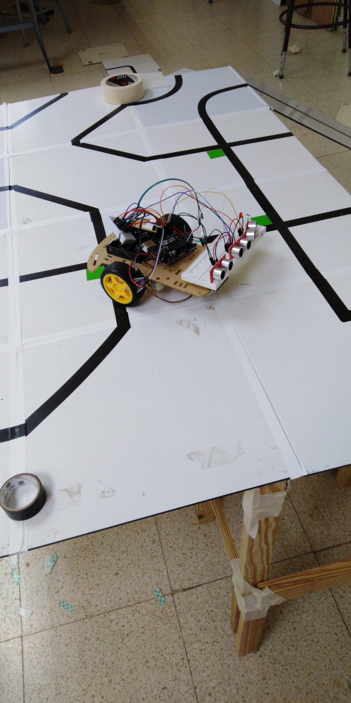
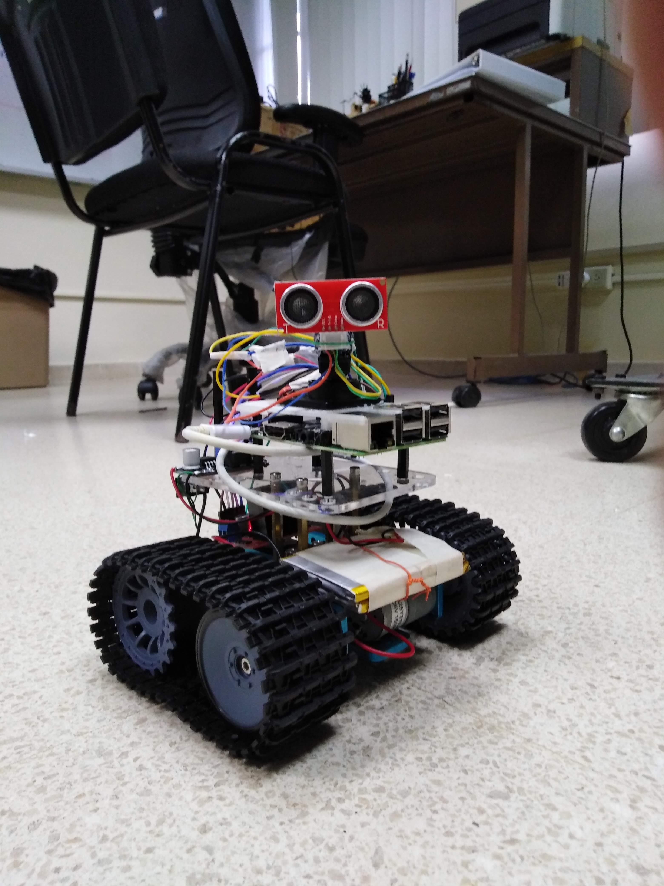
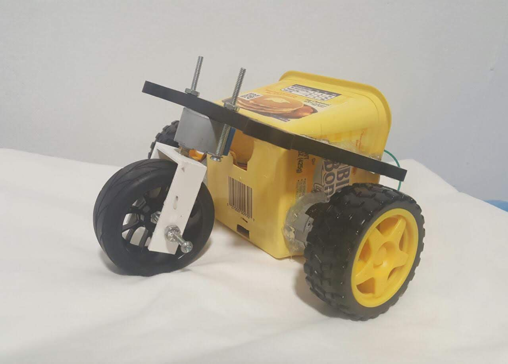
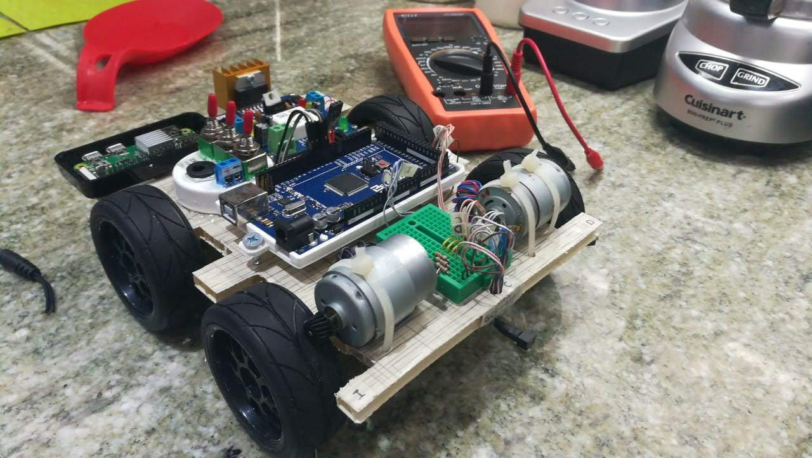

# Maze-Solver-Robots
We are working on a proposal to teach secondary teachers how to develop robots that are capable of solving a maze using open source platforms like Arduino and Raspberry.

Project Members:

Javier Romero.
> 

Fatima Batista.
> 

Sobenis.
> 

Gabriel Marzullo.
> 

Logistical info: 

Team Name: Intelligent-Systems-Laboratory

Organization: Technological University of Panama

Country: Panama 

Contact person: Danilo Caceres 

Email: danilo.caceres@utp.ac.pa 
